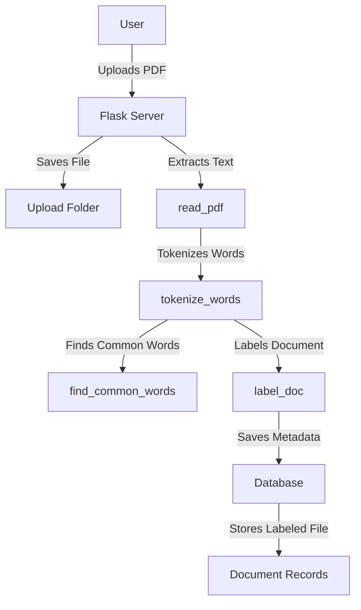
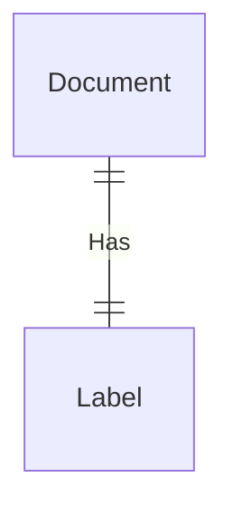

# Struttura applicazione


## 1. Obiettivi
- **Scopo:**
    Creare un'intelligenza artificiale in grado di:
    
    - Acquisire documenti in formato PDF
    - Analizzare il contenuto dei documenti
    - Classificarli automaticamente in categorie

## 2. Epica e User Stories
### Epica

- _Come utente voglio poter caricare documenti in formato PDF e farli classificare automaticamente in base al contenuto_

### User Story 1: Riconoscimento del contenuto

- _Il sistema deve riconoscere il testo per estrarre informazioni rilevanti_

### User Story 2: Classificazione dei documenti

- _Come utente voglio che il sistema classifichi automaticamente i documenti in categorie_

### User Story 3: Interfaccia

- _Come utente voglio un'interfaccia intuitiva_

## 5. Sprint
### Sprint 1

- **Obiettivi:**
    - Configurazione dell’ambiente di sviluppo (PyCharm)
    - Definizione della struttura (Python, ML, DB, Flask)

### Sprint 2

- **Attività:**
    - Progettazione e implementazione dei modelli di riconoscimento
    - Creazione e preparazione del dataset per l’addestramento.
    - Test dei modelli.

### Sprint 3

- **Attività:**
    - Addestramento dei modelli di classificazione
    - Validazione dei risultati e miglioramento degli algoritmi

### Sprint 4

- **Attività:**
    - Sviluppo del front-end
    - Integrazione delle API


## Database



## Overview

This Flask-based web application allows users to upload PDF files, extract and process text from them, identify common words, and classify the document based on predefined keywords. The extracted data is then stored in a database via a DAO (Data Access Object) module.

## Dependencies

- `os`
    
- `collections.Counter`
    
- `fitz` (PyMuPDF for PDF processing)
    
- `flask`
    
- `DAO` (A custom module for database operations)
    

## Application Structure

### 1. **Flask App Initialization**

```
app = Flask(__name__)
app.config['UPLOAD_FOLDER'] = 'uploads/'
```

- Initializes a Flask app.
    
- Sets the upload folder for storing uploaded PDFs.
    

### 2. **Routes**

#### **Homepage Route**

```
@app.route('/')
def index():
    return render_template('index.html')
```

- Renders the homepage.
    

#### **File Upload Route**

```
@app.route('/upload', methods=['POST', 'GET'])
def upload():
```

- Handles file uploads.
    
- Extracts text from PDFs and processes it.
    
- Identifies the most common words.
    
- Classifies the document based on predefined keywords.
    
- Saves document metadata in the database.
    

## Functions

### 1. **read_pdf(pdf_path)**

```
def read_pdf(pdf_path):
    doc = fitz.open(pdf_path)
    text = ''
    for page in doc:
        text += page.get_text().lower().replace("’", " ").replace('"', ' ')
    doc.close()
    return text
```

- Reads a PDF file and extracts text while converting it to lowercase and removing unwanted characters.
    

### 2. **tokenize_words(text)**

```
def tokenize_words(text):
    single_words = text.split()
    to_be_removed = ['istituto', 'tecnico', 'mario', 'delpozzo', 'degli', ...]
    filtered_words = [word for word in single_words if word not in to_be_removed and len(word) > 4 and word.isalpha()]
    return filtered_words
```

- Splits text into words.
    
- Removes unwanted words and short/non-alphabetic words.
    

### 3. **find_common_words(data)**

```
def find_common_words(data):
    word_count = Counter(data)
    return word_count.most_common(50)
```

- Finds the 50 most common words in the processed text.
    

### 4. **label_doc(list_of_words)**

```
def label_doc(list_of_words):
    words_to_be_found = [(word, label), ...]
    label = [label for word, label in words_to_be_found if word in list_of_words]
    return label[0] if label else 'altro'
```

- Labels the document based on the presence of predefined keywords.
    

### 5. **Main Execution Block**

```
if __name__ == '__main__':
    if not os.path.exists('uploads'):
        os.makedirs('uploads/')
    app.run()
```

- Ensures the upload directory exists.
    
- Runs the Flask application.

#### Modelli
1. https://huggingface.co/prithivMLmods/MBERT-Context-Specifier
2. https://huggingface.co/E-MIMIC/inclusively-classification
3. https://huggingface.co/mayapapaya/Keyword-Extractor
4. https://huggingface.co/tabularisai/multilingual-sentiment-analysis
5. https://huggingface.co/BAAI/bge-reranker-v2-m3
6. https://github.com/FabrizioDeSantis/multi-label-text-classification-bert

#### Datasets (lo creo io con le circolari dell'ITIS)
1. https://metatext.io/datasets/cc100-italian
2. https://huggingface.co/datasets/gsarti/clean_mc4_it
3. https://www.mdpi.com/2078-2489/13/5/228
4. https://paperswithcode.com/dataset/mldoc
5. https://github.com/laiguokun/xlu-data
6. https://paperswithcode.com/dataset/itacola
7. https://paperswithcode.com/dataset/italian-crime-news
8. https://paperswithcode.com/dataset/multilingual-top
9. https://paperswithcode.com/dataset/tilde-model-corpus
10. https://www.kaggle.com/datasets/alvations/old-newspapers?resource=download

#### Link utili
1. https://medium.com/@claude.feldges/text-classification-with-tf-idf-lstm-bert-a-quantitative-comparison-b8409b556cb3
2. https://www.klippa.com/en/blog/information/document-classification/
3. https://www.datacamp.com/tutorial/text-classification-python
4. https://www.analyticsvidhya.com/blog/2018/04/a-comprehensive-guide-to-understand-and-implement-text-classification-in-python/
5. https://medium.com/analytics-vidhya/nlp-tutorial-for-text-classification-in-python-8f19cd17b49e
6. https://medium.com/towards-data-science/naive-bayes-document-classification-in-python-e33ff50f937e
7. https://spotintelligence.com/2023/10/23/document-classification-python/
